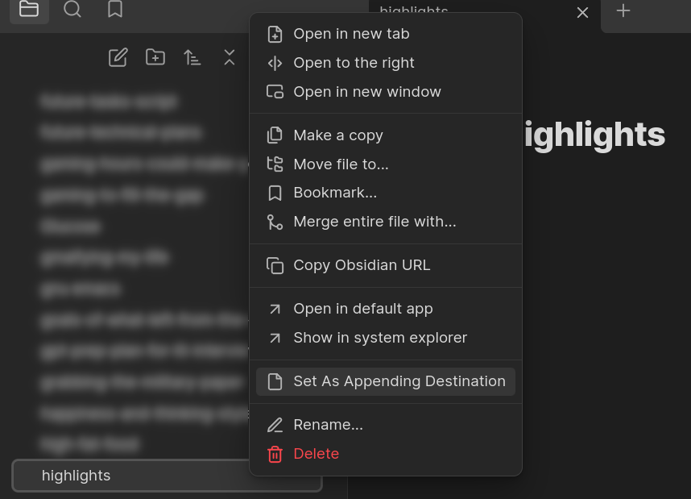
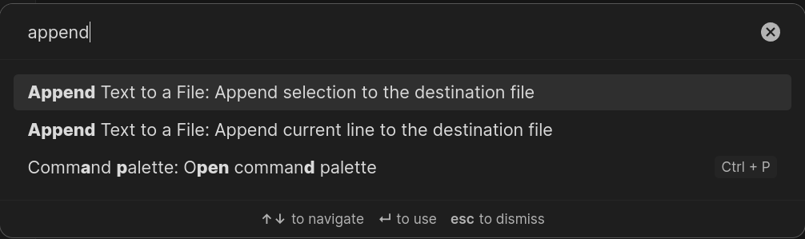

# Append Text To A File
A very simple plugin to append from current note to another note quickly.

# My Use Case
When I read my notes, I want to keep some highlights in a file, so I can view them back. So I made this plugin to help me doing that.

# How to use 
1. Set the Destination File :

2. Add Selection or Current line under cursor to the Destination File :
choose the command from the command menu:

# Todo :
- [ ]  add icon for this commands to make it easier and faster.
